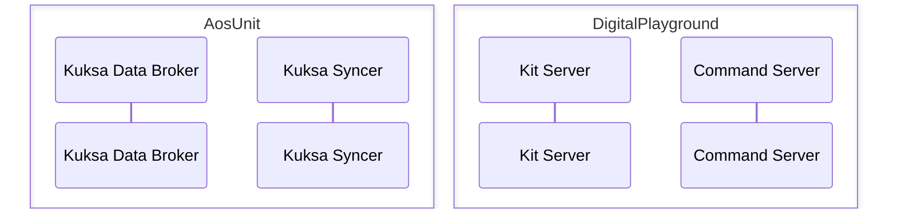

# Kuksa syncer

## General information

This is a copy of the original [Kuksa Syncer](https://github.com/eclipse-autowrx/sdv-runtime/tree/main/kuksa-syncer) with some modifications to run on Aos unit.

See [CHANGES.md](CHANGES.md) for the list of local modifications
(logging, VSS path alias layer, non-blocking subscribe, etc.).


## Service communication architecture



AosUnit on the diagram represents the unit on AosEdge UI/API.
KuksaSyncer is the service that are running on AosUnit and executes the commands from DigitalPlayground.

Digital Playground is the platform that are running on the Digital Auto side.

The service KuksaSyncer connects to the Digital Auto Playground via the KitServer and CommandServer. 
  No inbound connection is required. So, service can be run on any unit behind firewalls and NAT.

## Service program dependencies

KuksaSyncer are written in Python3 and uses the following libraries:
 - [python-socketio](https://python-socketio.readthedocs.io/en/stable/)
 - [kuksa-client](https://github.com/eclipse-kuksa/kuksa-python-sdk)

To satisfy the dependencies, the deployable Aos package includes next dependencies:
```yaml
  dependencies:
  - identity:
      type: layer
      codename: kuksa-client
    versions: ">=6.1.0-bosch.2"
  - identity:
      type: layer
      codename: pylibs
    versions: "6.1.0-bosch.2"
```

where 
 - kuksa-client is the Kuksa Python SDK
 - pylibs is the Python standard library

All layers and VM image are [here](https://github.com/aosedge/meta-aos-vm/releases/tag/v6.1.0-bosch.2)


## How to prepare unit and service to run

### Upload service

Use this project to upload the servoce. To upload using `Service Provider accound` just run command
```bash
aos-signer go
```

### Group subject

AosEdge team recommends to use group subject for services that should be run on many units.
  To create a group subject, under the OEM account use menu `Subjects` -> Button `Create` -> `Group` -> `Name` ->`+`

Assign all needed units to this group subject.

Assign the service to this subject.